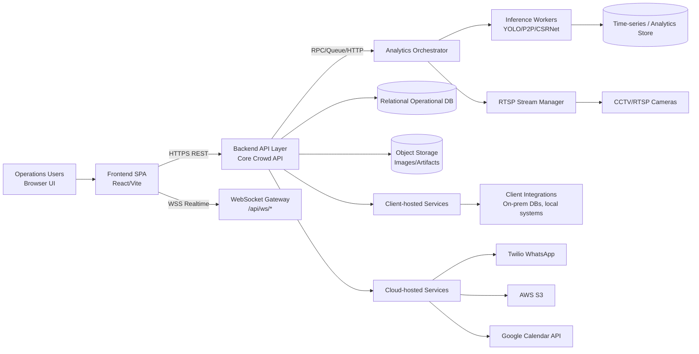
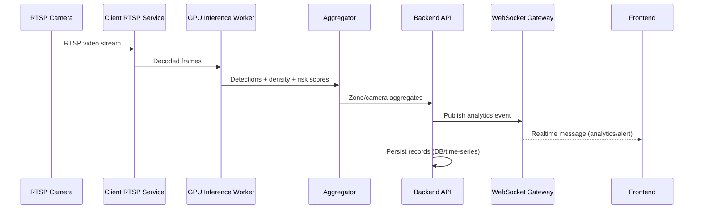

# Crowd Analytics System Architecture

Version: 1.0  
Date: 2026-03-25  
Audience: Engineering, DevOps, Security, Implementation teams

## 1. Purpose and Scope
This document defines the end-to-end architecture for the Crowd Analytics platform and clearly specifies:
- Component boundaries (Frontend, Backend APIs, Analytics services, Storage, Integrations)
- Communication and data flow between components
- Deployment split across Internal Cloud and Client Server environments
- Security controls for cross-environment communication
- Implementation reference for engineering teams

## 2. System Context
Crowd Analytics is a real-time and near-real-time platform for station crowd monitoring, risk scoring, alerts, and operational decision support.

Primary capabilities:
- Live zone/camera analytics (people count, density, risk)
- RTSP camera control and stream lifecycle management
- Alert generation and lifecycle handling
- Train schedule ingestion and upcoming train views
- Historical analytics and reports
- Optional external integrations (Google Calendar events, WhatsApp PA announcements)

## 3. High-Level Architecture

### 3.1 Logical Architecture Diagram


### 3.2 Deployment Architecture Diagram (Cloud vs Client)
```mermaid
flowchart TB
  subgraph Client[Client Server Environment (On-Prem / Client DC)]
    CAMS[IP Cameras / NVR]
    EDGE[Edge Ingestion + RTSP Service]
    GPU[GPU Analytics Workers\nRealtime inference]
    CLDB[(Client Operational DB / Cache)]
    LOCSVC[Client Local Services\n(optional connectors)]
  end

  subgraph Cloud[Internal Cloud Infrastructure]
    CDN[Web Hosting / CDN / Nginx]
    API[Core Backend APIs]
    WSG[WebSocket Gateway]
    ORCH[Analytics Orchestrator]
    CDB[(Cloud Relational DB)]
    TSD[(Analytics/Time-series Store)]
    OBJ[(Object Storage)]
    INTSVC[Integration Services]
    OBS[Observability\nLogs/Metrics/Tracing]
  end

  USER[Ops Team Browser] --> CDN
  CDN --> API
  USER --> WSG

  API <--> WSG
  API <--> ORCH
  ORCH <--> GPU
  EDGE <--> CAMS
  GPU <--> EDGE
  GPU --> TSD
  API <--> CDB
  API <--> OBJ

  API <--> LOCSVC
  API <--> CLDB

  INTSVC --> TWILIO[Twilio]
  INTSVC --> AWS[AWS S3]
  INTSVC --> GCAL[Google Calendar]
  API <--> INTSVC

  API --> OBS
  WSG --> OBS
  ORCH --> OBS
  GPU --> OBS
```

## 4. Component Definitions

### 4.1 Frontend Application (Current repo)
Technology:
- React + TypeScript + Vite
- REST via `fetch`
- Realtime via WebSocket

Key frontend modules (from current code):
- Dashboard/Realtime monitoring: `src/pages/Dashboard.tsx`
- Cameras management: `src/services/rtspApi.ts`, `src/hooks/useCameras.ts`
- Zone analytics: `src/services/zonesApi.ts`, `src/hooks/useZoneAnalytics.ts`
- Alerts: `src/services/alertApi.ts`, `src/hooks/useAlerts.ts`
- Trains: `src/services/trainsApi.ts`
- Calendar insights: `src/pages/FootfallInsights.tsx`, `src/services/googleCalendar.ts`
- User location: `src/services/userLocationApi.ts`
- WebSocket manager: `src/services/websocketService.ts`

Runtime endpoints configured through:
- `VITE_API_URL` (REST base, default `http://localhost:8000/api` in local)
- `VITE_WS_URL` (optional explicit WebSocket base)

### 4.2 Backend APIs (Core Crowd API)
Responsibilities:
- API entry point for frontend
- Authentication/authorization
- CRUD/control for cameras/streams/zones
- Query and aggregate analytics data
- Alerts lifecycle and reporting
- Train schedule upload and retrieval
- Orchestration of analytics and integrations

Observed API domains in code:
- `/api/rtsp/*`
- `/api/cameras/*`
- `/api/zones/*`
- `/api/alerts*`, `/api/island-alerts/live`
- `/api/trains/*`
- `/api/analytics/*` and history endpoints
- `/api/ws/*` (realtime push)

### 4.3 Crowd Analytics Processing Services
Responsibilities:
- Video ingestion (RTSP)
- Frame sampling/preprocessing
- ML inference (people detection, density, risk scoring)
- Zone-level and camera-level aggregation
- Publishing results to storage + realtime channels

Recommended internal service split:
- `stream-ingestor`: camera connectivity, frame capture, health
- `inference-worker`: YOLO/P2P/CSRNet or equivalent models on GPU
- `aggregator`: computes per-zone/per-station metrics and risk labels
- `event-publisher`: emits analytics/alerts to WebSocket and alert engine

### 4.4 Database and Storage
Recommended stores:
- Operational relational DB (PostgreSQL/MySQL): cameras, zones, users, schedules, alert metadata
- Time-series/analytics store (TimescaleDB/ClickHouse/Influx): high-frequency metrics
- Object storage (S3-compatible): snapshots, heatmaps, audio/media artifacts
- Optional cache/message broker (Redis): transient state, queues, pub/sub

### 4.5 Integration Services
Integrations currently reflected in repo:
- Twilio WhatsApp + AWS S3 (Node integration service in `server.js`)
- Google Calendar (public events) from frontend
- Client-side local services (location and client-hosted connectors)

Recommended pattern:
- Move all external calls behind backend/integration service boundary
- Avoid direct third-party calls from frontend except low-risk public data if required

## 5. Communication Flows

### 5.1 Frontend -> Backend APIs
Transport:
- HTTPS REST for request/response operations
- WSS for realtime analytics and alerts

Typical flows:
1. User opens dashboard
2. Frontend calls zone/camera/alerts/trains APIs
3. Frontend subscribes to `/api/ws/analytics` or `/api/ws/zones/analytics`
4. Backend pushes analytics/alert events
5. UI updates maps/cards/graphs

### 5.2 Backend -> Analytics Services
Flow:
1. Backend receives control/data request
2. Backend triggers analytics orchestrator
3. Analytics workers process streams and compute metrics
4. Results persisted to analytics store
5. Backend reads aggregates and pushes realtime updates to WebSocket

### 5.3 Backend -> Client-hosted Services
Use cases:
- Read/write data from on-prem client systems
- Fetch local train/ops feeds
- Push or pull status from client LAN services

Communication pattern:
- Prefer outbound-only from client to cloud via secure connector when possible
- If cloud-to-client required, use VPN/private link + allowlisted ingress + mTLS

### 5.4 Backend -> Cloud-hosted Services
Use cases:
- Notification service (Twilio)
- Media/object persistence (S3)
- Optional public event/calendar services

Communication pattern:
- HTTPS with service credentials from secret manager
- Retry with backoff and dead-letter handling for failures

## 6. Deployment Ownership Matrix

| Component | Primary Deployment | Secondary/Optional | Notes |
|---|---|---|---|
| Frontend SPA | Internal Cloud | Client reverse proxy cache | Served via CDN/Nginx |
| API Gateway / Backend | Internal Cloud | Client edge API (optional) | Main control plane |
| WebSocket Gateway | Internal Cloud | Client edge WS relay (optional) | Realtime feed |
| RTSP Ingestion | Client Server | Internal Cloud (lab/dev) | Should remain close to cameras |
| GPU Inference Workers | Client Server | Internal Cloud GPU nodes | On-prem preferred for latency/privacy |
| Analytics Aggregator | Internal Cloud | Client edge aggregator | Depends on data residency policy |
| Operational DB | Internal Cloud | Client DB mirror | Config/metadata source of truth |
| Time-series Store | Internal Cloud | Client local buffer | High-volume analytics history |
| Object Storage | Internal Cloud | Client NAS (optional) | Snapshots/media |
| Twilio/S3 Integrations | Internal Cloud | N/A | External SaaS access |
| Client Local Connectors | Client Server | N/A | Client-owned systems |

## 7. Detailed Data Flow

### 7.1 Realtime Analytics Data Path


### 7.2 Alert Lifecycle
1. Inference/Aggregator detects threshold breach
2. Alert engine creates alert with severity and trigger reason
3. Alert saved in operational DB
4. Alert emitted over WebSocket
5. Frontend displays and allows acknowledge/resolve
6. Backend updates alert status, records audit trail

### 7.3 Historical Reporting Flow
1. Frontend queries `/analytics/*/history` and `/alerts/report/stats`
2. Backend reads pre-aggregated data from time-series + operational DB
3. Response returned with time windows and aggregates
4. Frontend renders charts/report pages

## 8. API and Messaging Contracts (Implementation Reference)

### 8.1 REST Domains (current frontend usage)
- Analytics history: `/analytics/fob/history`, `/analytics/zone/history`, `/analytics/station/history`
- Zones: `/zones`, `/zones/station/{id}`, `/zones/analytics`, `/zones/{id}/analytics`
- Cameras/RTSP: `/cameras/*`, `/rtsp/*`
- Alerts: `/alerts`, `/alerts/active`, `/alerts/{id}`, `/alerts/{id}/acknowledge`, `/alerts/{id}/resolve`, `/alerts/report/stats`, `/island-alerts/live`
- Trains: `/trains/upload`, `/trains/upcoming`
- User location: `/location/all`

### 8.2 WebSocket Message Types
- `analytics` (camera + zone stats payload)
- `alert` (severity/status/trigger payload)
- `zone_analytics` (station-scoped zone rollup)
- `train_schedule` (upcoming train updates)

## 9. Security Architecture

### 9.1 Network Security
- Enforce TLS 1.2+ for all HTTPS/WSS links
- Use private networking (VPN/private link) between cloud backend and client environment
- Allowlist source/destination IPs and ports per service
- Segment networks: DMZ/API, processing, data, integration

### 9.2 Identity and Access
- OIDC/JWT-based auth for frontend users
- Service-to-service authentication via mTLS or signed service tokens
- RBAC roles: Admin, Operator, Viewer, Integration-Service
- Least privilege IAM for cloud services (S3, messaging, secrets)

### 9.3 Data Security
- Encrypt in transit (TLS) and at rest (DB/storage encryption)
- Pseudonymize or minimize PII in analytics streams
- Redact sensitive fields in logs and alerts
- Define retention periods for video-derived artifacts and alerts

### 9.4 Secret Management
- Store credentials in secret manager (not in frontend code or `.env` committed files)
- Rotate external API keys and tokens periodically
- Use short-lived credentials where supported

### 9.5 Cross-Environment Controls (Cloud <-> Client)
- Prefer client-initiated outbound connector over inbound public exposure
- If inbound needed, require mTLS + WAF + strict allowlists
- Add request signing and replay protection for sensitive operations
- Audit all cross-boundary API calls

## 10. Reliability, Scalability, and Operations

### 10.1 Reliability Patterns
- WebSocket auto-reconnect with backoff (already used by frontend)
- Polling fallback when WebSocket unavailable (already used)
- Circuit breakers/timeouts for external integrations
- Retry + dead-letter queue for notification jobs

### 10.2 Scalability Patterns
- Horizontal scale for API and WebSocket gateway
- Partition analytics workers by station/camera groups
- Batch and window aggregations for historical endpoints
- Cache hot read endpoints

### 10.3 Observability
- Centralized logs with correlation IDs
- Metrics: stream health, frame latency, queue depth, alert rate, API p95, WS disconnects
- Distributed tracing across API -> analytics -> integrations
- SLOs and alerting for critical paths

## 11. Environment Strategy

### 11.1 Environments
- `DEV`: mock/sandbox integrations, low-volume streams
- `UAT`: production-like topology with limited cameras
- `PROD`: full deployment split (cloud + client)

### 11.2 Configuration
- Environment-specific API base URLs and WS URLs
- Feature flags for integrations (Twilio, Calendar, location feeds)
- Station/site-level configuration for zone mappings and thresholds

## 12. Implementation Blueprint

### Phase 1: Foundation
- Establish API gateway, auth, DB schemas, and WS gateway
- Deploy client-side RTSP + GPU inference stack
- Implement secure cloud-client connectivity

### Phase 2: Core Analytics
- Wire camera -> inference -> aggregation -> storage pipeline
- Publish realtime events and dashboard feed
- Enable alert engine and lifecycle APIs

### Phase 3: Integrations and Hardening
- Integrate trains, notifications, and external services via integration layer
- Add observability, SLOs, and DR procedures
- Security hardening and penetration testing

## 13. Traceability to Acceptance Criteria

1. Architecture diagram clearly shows all system components.  
Status: Completed in Sections 3.1 and 3.2.

2. Frontend, backend, and service communication flow is documented.  
Status: Completed in Sections 5 and 7.

3. Deployment locations for each service (client server / cloud) are defined.  
Status: Completed in Section 6.

4. Documentation is shared with the team for implementation reference.  
Status: This document is implementation-ready and can be shared directly.

## 14. Current-State Notes from Existing Codebase
- Frontend already supports REST + WebSocket with fallback polling.
- API domains for zones/cameras/rtsp/alerts/trains are already integrated in frontend services.
- A separate Node integration service exists for WhatsApp audio delivery (Twilio + S3).
- Authentication module currently contains mock-path implementation and should be aligned to production auth.
- External API keys/secrets must be moved to secure secret management and rotated before production.

## 15. Team Handover Checklist
- Confirm final system-of-record for operational DB and analytics store
- Finalize cloud-client network topology (VPN/private link)
- Approve API contracts and versioning
- Approve security controls (mTLS, JWT scopes, IAM policies)
- Define runbooks for stream failure, inference degradation, and integration outages
- Baseline load/performance test at expected camera scale

